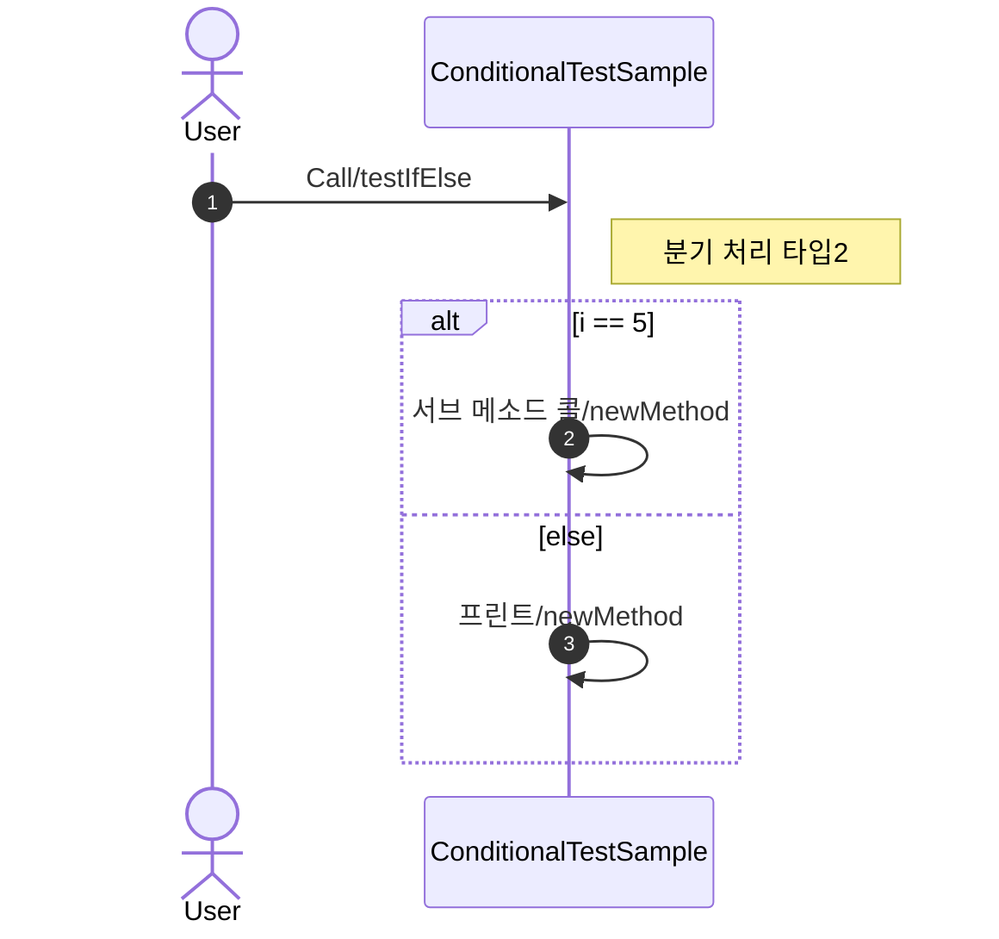

# GenDia

작동 방식 :

* markdown에 sequenceDiagram 표기 추가
* 첫라인에 대상 클래스및 시작메소드 표기

[//]: # (    ```mermaid)

    sequenceDiagram
    ##class:클래스A,클래스B,클래스C
    ##startPoint:클래스A.메소드1,클래스A.메소드2
    
    mermaid 표기법에 따른 다이어그램......

[//]: # (    ```)
CodeDoc
info
lang
diagram
params
param1


